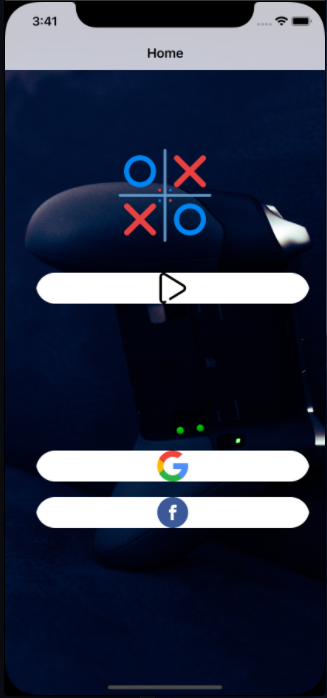

# TicTacToe using CollectionView
 Simple TicTacToe Game Using Collection View

#### UIElements
 
 - UILabel
 - UIButton
 - UIImageView
 - UICollectionView
 - UITableViewDelegate
 - UITableViewDataSource
 - UICollectionViewFlowLayout

 #### Output
 

